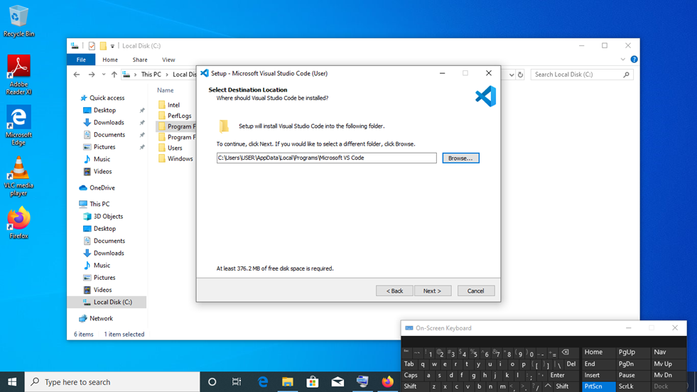
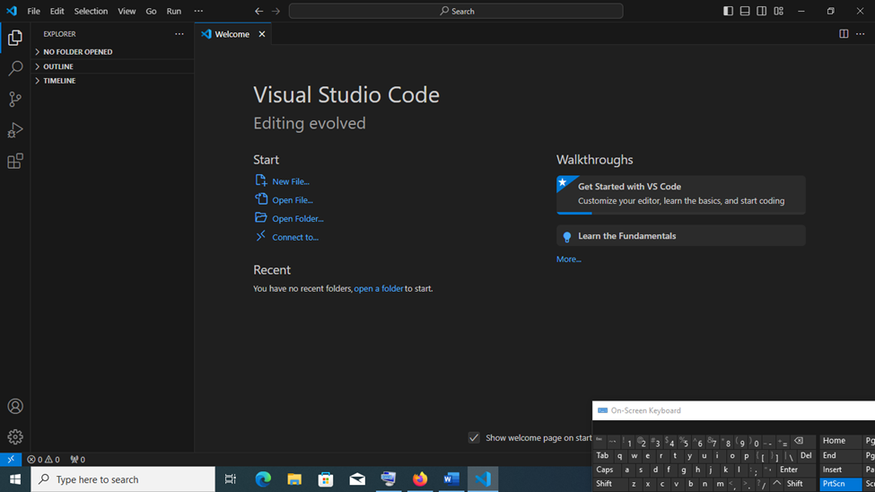
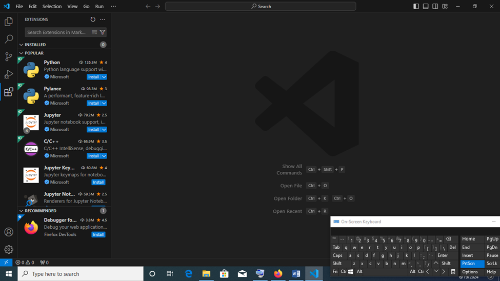
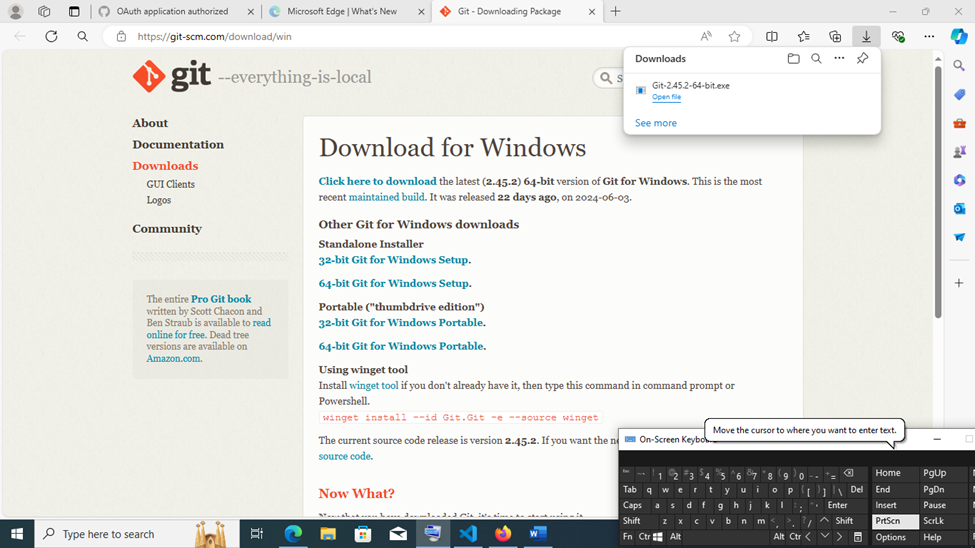
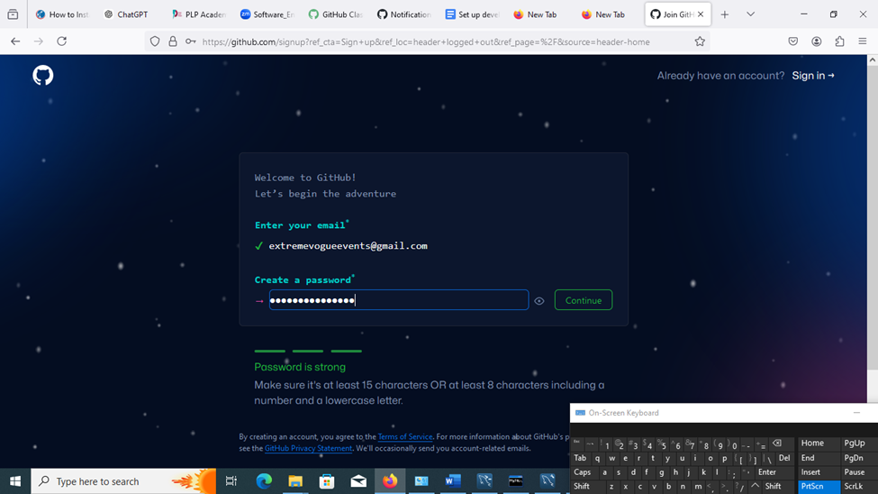
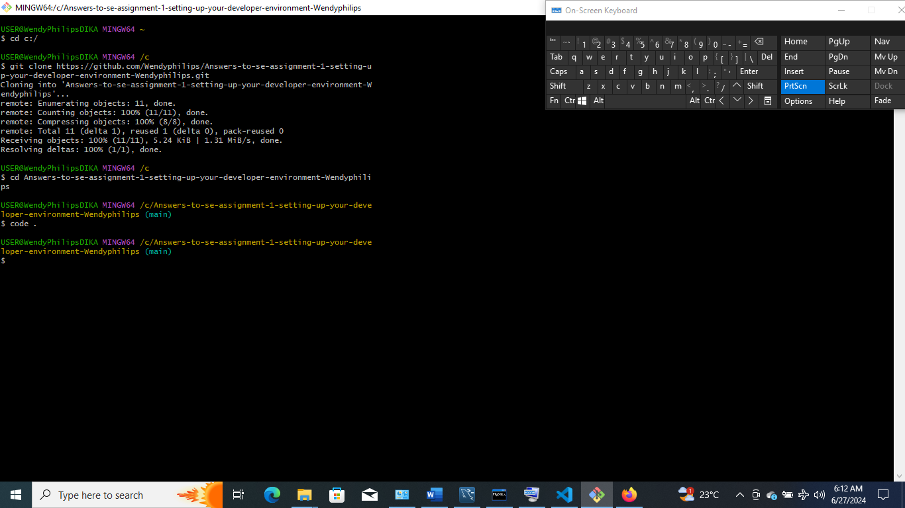
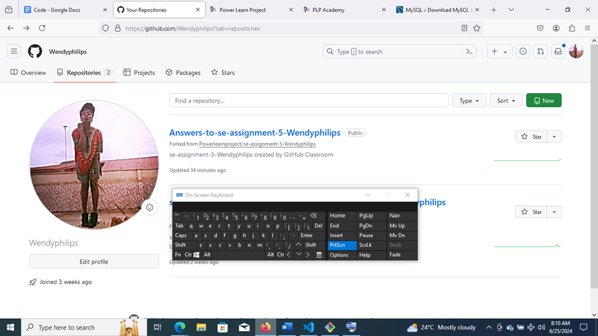
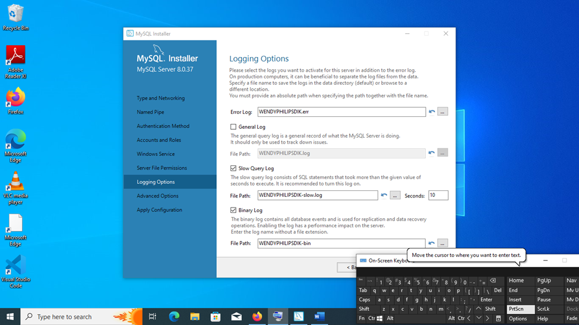
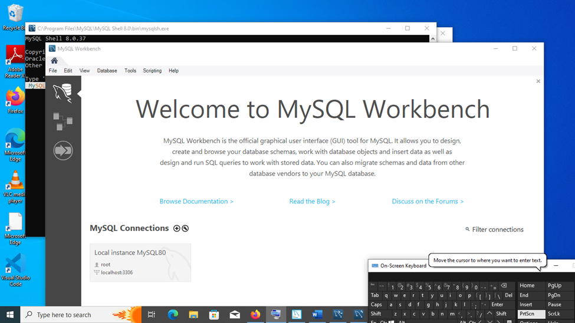
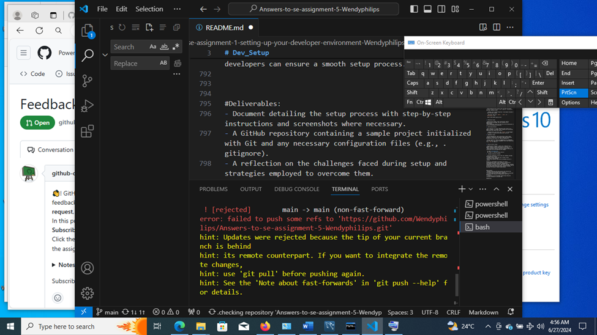

# Dev_Setup
Setup Development Environment

#Assignment: Setting Up Your Developer Environment

#Objective:
This assignment aims to familiarize you with the tools and configurations necessary to set up an efficient developer environment for software engineering projects. Completing this assignment will give you the skills required to set up a robust and productive workspace conducive to coding, debugging, version control, and collaboration.

#Tasks:

1. Select Your Operating System (OS):
   Choose an operating system that best suits your preferences and project requirements. Download and Install Windows 11. https://www.microsoft.com/software-download/windows11

   The Windows operating system (OS) is a series of graphical operating systems developed by Microsoft. It is designed to run on personal computers (PCs), including desktops, laptops, tablets, and other devices. Windows provides a user-friendly interface and supports a wide range of applications and hardware.

Step-by-Step Guide to Download and Install Windows 11

Step 1: Check System Requirements
Before downloading Windows 11, ensure your PC meets the minimum system requirements. You can use the PC Health Check app from Microsoft to verify your system's compatibility.

Step 2: Backup Your Data
Before starting the installation, it's crucial to back up your important files and data. You can use external storage devices or cloud services for backup.

Step 3: Download Windows 11 Installation Media
1. Visit the Official Microsoft Windows 11 Download Page:
   - Go to [Windows 11 Download](https://www.microsoft.com/software-download/windows11).
   
2. Download the Installation Media:
   - On the download page, click on "Download now" under the "Windows 11 Installation Assistant" section.
   - Follow the instructions to download the tool.

Step 4: Create Installation Media

1. Run the Installation Media Tool:
   - Open the downloaded tool (MediaCreationToolW11.exe).
   - Accept the license terms.
   
2. Create Installation Media:
   - Choose the option to create installation media and click "Next".
   - Select the language, edition, and architecture (64-bit) and click "Next".
   - Choose USB flash drive if you want to create a bootable USB drive or ISO file if you want to create a bootable DVD.
   - Follow the instructions to complete the creation of installation media.

Step 5: Install Windows 11

1. Insert Installation Media:
   - Insert the USB flash drive into the PC where you want to install Windows 11.

2. Boot from Installation Media:
   - Restart your PC and enter the BIOS/UEFI settings (usually by pressing F2, F12, Del, or Esc during startup).
   - Change the boot order to boot from the USB drive or DVD.
   - Save and exit the BIOS/UEFI settings.

3. Start Installation:
   - Your PC will boot from the installation media, and you will see the Windows Setup screen.
   - Select your language, time, and keyboard preferences and click "Next".
   - Click "Install now".

7.Begin Installation:
   - Click "Next" to start the installation. The process will take some time and your PC will restart several times.

8. Configure Windows 11:
   - After installation, follow the on-screen instructions to configure Windows 11, including setting up your user account, region, and privacy settings.

2. Install a Text Editor or Integrated Development Environment (IDE):
   Select and install a text editor or IDE suitable for your programming languages and workflow. Download and Install Visual Studio Code. https://code.visualstudio.com/Download

Installing Visual Studio Code (VS Code)

Visual Studio Code (VS Code)  is a free, open-source code editor developed by Microsoft. It supports various programming languages and is highly customizable through extensions.

Step-by-Step Installation on Windows

1. Download VS Code
   - Visit the official [VS Code website](https://code.visualstudio.com/).
   - Click on the "Download for Windows" button.

2. Run the Installer
   - Open the downloaded file (`VSCodeUserSetup-x64-1.56.2.exe` or similar).
   - Follow the installation wizard:
     - Accept the license agreement.
     - Choose the installation location (the default is usually fine).
     - Select additional tasks (e.g., create a desktop icon, add to PATH).

3. Launch VS Code
   - Once the installation is complete, click "Finish" to launch VS Code.
   - You can also open it from the Start menu or the desktop icon.

After installing Visual Studio Code, you can optimize it for an efficient coding environment by adjusting various settings and configurations. Here are the steps to set up VS Code for an optimal development experience:

 1. Install Essential Extensions

- Python (by Microsoft): Provides support for Python development.
- Pylance(by Microsoft): Enhances the Python extension with better IntelliSense and type checking.
- ESLint(by Microsoft): Integrates ESLint for JavaScript linting.
- Prettier - Code formatter** (by Prettier): Ensures consistent code formatting.
- GitLens (by GitKraken): Enhances Git capabilities.
- Jupyter (by Microsoft): Adds support for Jupyter notebooks.

To install extensions:

1. Open the Extensions view by clicking on the Extensions icon in the Activity Bar or pressing `Ctrl+Shift+X`.
2. Search for each extension by name and click "Install".

2. Select a Theme

- Choose a theme that is comfortable for your eyes and enhances readability.
  - Go to `File` > `Preferences` > `Color Theme`.
  - Choose from the available themes or search for more in the Extensions view.

3. Set Up Your Workspace

- Create or open a folder to use as your workspace.
  - Go to `File` > `Open Folder`.
  - Select the folder where your project files are located.

4. Configure Python Interpreter

- Press `Ctrl+Shift+P` to open the Command Palette.
- Type "Python: Select Interpreter" and choose the Python interpreter you want to use.

5. Enable Format on Save

- Automatically format your code when you save it to maintain a consistent style.
  - Go to `File` > `Preferences` > `Settings` or press `Ctrl+,`.
  - Search for "format on save" and check the box for `Editor: Format On Save`.

6. Configure Linters and Formatters

- For Python:
  - Enable your preferred linter (e.g., Pylint, Flake8).
    - Press `Ctrl+Shift+P`, type "Python: Select Linter", and choose the linter you prefer.
  - Configure Black as the formatter (if using Black).
    - Go to `File` > `Preferences` > `Settings`.
    - Search for `python formatting provider` and set it to `black`.
    - Ensure `editor.formatOnSave` is checked.

- For JavaScript/TypeScript
  - Enable ESLint.
    - Create an `.eslintrc.json` file in your project directory if not already present.
    - Configure ESLint rules as needed.
  - Configure Prettier.
    - Create a `.prettierrc` file in your project directory with your preferred settings.

7. Customize Terminal Settings

- Open the integrated terminal by pressing `Ctrl+` `. 
- Customize the terminal settings for better usability.
  - Go to `File` > `Preferences` > `Settings`.
  - Search for `terminal integrated` to find terminal settings.
  - Adjust font size, cursor style, and shell path as needed.

 8. Set Up Keybindings

- Customize keybindings to match your workflow.
  - Go to `File` > `Preferences` > `Keyboard Shortcuts` or press `Ctrl+K Ctrl+S`.
  - Modify keybindings as needed and save the changes.

9. Configure Git Integration

- Ensure Git is properly configured for version control.
  - Go to `File` > `Preferences` > `Settings`.
  - Search for `git enabled` and ensure it is checked.
  - Set your user name and email for Git:
    
    git config --global user.name "Your Name"
    git config --global user.email "your.email@example.com"
    

10. Enable Autosave

- Enable autosave to avoid losing changes.
  - Go to `File` > `Preferences` > `Settings`.
  - Search for `files autosave` and set it to `afterDelay`.

11. Configure Tab Settings

- Adjust tab settings to match your coding style.
  - Go to `File` > `Preferences` > `Settings`.
  - Search for `editor tab size` and set your preferred tab size.
  - Set `editor insert spaces` to use spaces instead of tabs if preferred.

Conclusion

By following these steps, you can configure Visual Studio Code to provide an optimal coding environment tailored to your needs. These adjustments enhance productivity, ensure code quality, and streamline your workflow.

3. Set Up Version Control System:
   Install Git and configure it on your local machine. Create a GitHub account for hosting your repositories. Initialize a Git repository for your project and make your first commit. https://github.com

GIT FOR WINDOWS 

Step 1: Download Git for Windows

1. Visit Git Website: Go to the official Git website [git-scm.com](https://git-scm.com/).
2. Download Git: Click on the "Download" button for Windows. The download should start automatically.

Step 2: Install Git

1. Open the Installer: Find the downloaded Git installer file (usually in your Downloads folder) and double-click it to run the installer.

2. Start Installation: If prompted by User Account Control, click "Yes" to allow the installer to run.

3. Setup Wizard: Follow the steps in the setup wizard:

   - License Agreement: Read and accept the license agreement, then click "Next."

   - Select Destination Location: Choose the default location or a different folder where you want to install Git, then click "Next."

   - Select Components: Choose the default components or customize your installation, then click "Next."

   - Select Start Menu Folder: Choose the default start menu folder or change it, then click "Next."

   - Adjusting Your PATH Environment: Select the option "Git from the command line and also from 3rd-party software," then click "Next."

   - Choosing the SSH executable: Choose the default "Use OpenSSH," then click "Next."

   - Choosing HTTPS Transport Backend: Choose "Use the OpenSSL library," then click "Next."

   - Configuring the line ending conversions: Choose "Checkout Windows-style, commit Unix-style line endings," then click "Next."

   - Configuring the terminal emulator to use with Git Bash: Choose "Use MinTTY (the default terminal of MSYS2)," then click "Next."

   - Choose the default behavior of 'git pull': Choose "Default (fast-forward or merge)," then click "Next."

   - Choose a credential helper: Choose "Git Credential Manager Core," then click "Next."

   - Enable file system caching: Keep the default selection, then click "Next."

   - Enable symbolic links: Keep the default selection, then click "Next."

4. Install: Click "Install" to start the installation process.

5. Finish: Once the installation is complete, check "Launch Git Bash" if you want to start it immediately, then click "Finish."

Step 3: Configure Git

1. Open Git Bash: If you didn't launch Git Bash during installation, you can find it in your Start menu. Open Git Bash.
2. Set Your Username: Type the following command and press Enter, replacing "Your Name" with your actual name:
   
   git config --global user.name "Your Name"
   
3. Set Your Email: Type the following command and press Enter, replacing "your.email@example.com" with your actual email address:
 
   git config --global user.email "your.email@example.com"

   
   

Step 4: Verify Installation

1. Check Git Version: In Git Bash, type the following command and press Enter:
   
   git --version
   
   This will show the installed version of Git, confirming that Git is installed correctly.

ii.) CREATING GITHUB ACCOUNT 

Creating a GitHub account is straightforward. Here's a step-by-step guide:

Step 1: Visit the GitHub Website

1. Open Your Web Browser: Use any web browser (e.g., Chrome, Firefox).
2. Go to GitHub: Type in the URL [https://github.com](https://github.com) and press Enter.

Step 2: Sign Up for a New Account

1. Sign Up Button: Click on the "Sign up" button usually located at the top-right corner of the page.
2. Enter Your Details:
   - Username: Choose a unique username. This will be your public handle on GitHub.
   - Email Address: Enter a valid email address.
   - Password: Create a strong password.
3. Solve the Puzzle: Complete the CAPTCHA or puzzle to verify you are not a robot.
4. Create Account: Click on the "Create account" button.

Step 3: Set Up Your Account

1. Choose a Plan: GitHub offers free and paid plans. Choose the free plan unless you need advanced features.

2. Personalize Your Experience:
   - GitHub may ask a few questions about your experience level and interests to personalize your experience. You can skip these questions if you prefer.

Step 4: Verify Your Email
1.Check Your Email: GitHub will send a verification email to the address you provided.
2. Open the Email: Look for an email from GitHub and open it.
3. Verify Email: Click the verification link in the email to confirm your email address.

Step 5: Complete Your Profile
1. Profile Information: Optionally, you can add more details to your profile such as your bio, profile picture, and additional contact information.
2. Finish: After completing the profile setup, you are ready to start using GitHub.

ii) INITIALIZING A REPOSITORY 

Initializing a repository for a project with your GitHub account involves a few steps. Here's a simple guide:

### Step 1: Create a Repository on GitHub
1. **Log In**: Go to [GitHub](https://github.com) and log in to your account.
2. **New Repository**: Click the "+" icon in the top right corner and select "New repository".
3. **Repository Details**:
   - **Repository Name**: Enter a name for your repository.
   - **Description**: Optionally, add a description of your project.
   - **Public or Private**: Choose whether the repository will be public (visible to everyone) or private (only you and people you choose can see it).
   - **Initialize Repository**: Check "Initialize this repository with a README" if you want GitHub to create a README file for you.
4. **Create Repository**: Click the "Create repository" button.

Step 2: Initialize a Local Repository and Link it to GitHub

1. Open Git Bash:  Open Git Bash on your computer.

2. Navigate to Your Project Folder:
 
   cd /path/to/your/project
   
3. Initialize Local Repository:

   git init
   
4. Add Files: Add the files in your project to the staging area.

   git add .

5. Commit Files: Commit the files to the local repository.
 
   git commit -m "Initial commit"

   
  

Step 3: Link Local Repository to GitHub
1. Copy Repository URL: Go back to your GitHub repository page and copy the repository URL. It should look something like 

`https://github.com/yourusername/repositoryname.git`.

2. Add Remote: In Git Bash, link your local repository to the GitHub repository.
 
   git remote add origin

https://github.com/yourusername/repositoryname.git
   

3. Push to GitHub: Push your local repository to GitHub.
 
   git push -u origin master

   

4. Install Necessary Programming Languages and Runtimes:
  Instal Python from http://wwww.python.org programming language required for your project and install their respective compilers, interpreters, or runtimes. Ensure you have the necessary tools to build and execute your code.

PYTHON

Python is a programming language that is easy to read and write. It is used for many things, like making websites, analyzing data, and creating software. Python's simple syntax makes it a good choice for beginners and experts alike. It has many built-in tools and libraries that help you do different tasks quickly.

HOW TO DOWNLOAD AND INSTALL PYTHON PROGRAMING LANGUAGE 

Step 1: Download Python
1. Visit the Python Website:
   - Open your web browser and go to [python.org](https://www.python.org/).

2. Go to the Downloads Page:
   - Click on the "Downloads" menu.
   - The website will suggest the latest version of Python for your operating system. Click the "Download Python [version]" button.

Step 2: Install Python
1. Open the Installer:
   - Find the downloaded file in your "Downloads" folder and double-click it to open.

2. Run the Installer:
   - In the installer window, check the box that says "Add Python to PATH." This is important for running Python from the command line.
   - Click the "Install Now" button.

3. Wait for Installation:
   - The installer will copy the necessary files to your laptop. This may take a few minutes.

4. Verify Installation:
   - Open the Command Prompt (Windows) or Terminal (Mac/Linux).
   - Type `python --version` and press Enter. You should see the Python version you installed, confirming the installation.

Step 3: Install a Code Editor (Recommended)
1. Download Visual Studio Code (VS Code):
   - Go to the [VS Code website](https://code.visualstudio.com/).
   - Click on the "Download" button for your operating system.

2. Install VS Code:
   - Open the downloaded installer file and follow the instructions to install VS Code.

Step 4: Set Up Python in VS Code
1. Open VS Code:
   - Launch VS Code from your applications menu or desktop shortcut.

2. Install Python Extension:
   - Click on the Extensions icon on the left sidebar (it looks like a square).
   - In the search bar, type "Python" and find the Python extension by Microsoft. Click "Install."

Step 5: Verify Everything Works
1. Create a New Python File:
   - Open VS Code and create a new file with a `.py` extension (e.g., `hello.py`).

2. Write a Simple Program:
   - Type the following code:
     python
 print("Hello, World!")
     

3. Run the Program:
   - Save the file and then open the terminal in VS Code by pressing `Ctrl + ` (backtick) or selecting "Terminal" > "New Terminal" from the menu.
   - In the terminal, type `python hello.py` and press Enter. You should see "Hello, World!" printed in the terminal.

This setup includes everything you need to start building and executing Python code.

5. Install Package Managers:
   If applicable, install package managers like pip (Python).

PACKAGE MANAGER (pip)

Package managers are tools that help you install, update, and manage software packages. These packages are collections of files and code that add specific features or functions to your programs. Package managers make it easy to get and use these packages without having to manually download and set them up. For example, `pip` is a package manager for Python that lets you quickly add libraries and tools to your Python projects.

Step 1: Check if pip is Already Installed
1. Open Command Prompt (Windows) or Terminal (Mac/Linux):
   - Open your Command Prompt or Terminal.

2. Check for pip:
   - Type `pip --version` and press Enter.
   - If pip is already installed, you will see the version number. If not, you can proceed with the installation.

Step 2: Install pip (If Not Already Installed)
1. Download get-pip.py:
   - Go to your web browser and visit [get-pip.py](https://bootstrap.pypa.io/get-pip.py).
   - Right-click on the page and select "Save As" to download the `get-pip.py` file to your computer.

2. Open Command Prompt (Windows) or Terminal (Mac/Linux):
   - Navigate to the folder where you downloaded `get-pip.py`. Use the `cd` command to change directories. For example:
     
     cd Downloads
     

3. Run the get-pip.py Script:
   - In the Command Prompt or Terminal, type:
    
     python get-pip.py
     
   - Press Enter. This will install pip on your system.

Step 3: Verify pip Installation
Check pip Version:
   - After installation, verify that pip is installed correctly by typing:
     
     pip --version
     
   - You should see the pip version number, confirming that pip is installed.

Step 4: Update pip (Optional)
1. Update pip to the Latest Version:
   - To make sure you have the latest version of pip, you can update it by typing:
     
     python -m pip install --upgrade pip
     

6. Configure a Database (MySQL):
   Download and install MySQL database. https://dev.mysql.com/downloads/windows/installer/5.7.html

MY SQL

MySQL is an open-source relational database management system (RDBMS). It uses structured query language (SQL) for accessing, adding, and managing data in databases. MySQL is widely used for web applications and is a central component of the LAMP stack (Linux, Apache, MySQL, PHP/Perl/Python).

How to Download and Install MySQL

Step 1: Download MySQL Installer

1. Visit MySQL Website: Go to the official MySQL website [here](https://dev.mysql.com/downloads/installer/).
2. Choose MySQL Installer: Click on "MySQL Installer for Windows."
3. Select Version: Choose the version you need and click "Download."

Step 2: Run the Installer

1. Open Installer: Find the downloaded file (usually in your Downloads folder) and double-click to open it.
2. Start Installation: Click "Yes" if prompted by User Account Control.

Step 3: Choose Setup Type

1. Setup Type: You will see several setup types. Choose "Developer Default" for a complete setup, which includes MySQL Server, MySQL Workbench, and other tools.
2. Click Next: Click the "Next" button to proceed.

Step 4: Check Requirements

1. Check Requirements: The installer will check if your system meets the requirements.
2. Resolve Issues: If there are any missing requirements, the installer will guide you to install them.
3. Click Next: Once all requirements are met, click "Next."

 Step 5: Install MySQL

1. Ready to Install: The installer will show the components to be installed.
2. Click Execute: Click the "Execute" button to start the installation.

Step 6: Configure MySQL Server

1. Configuration: After installation, you will need to configure MySQL Server.
2. Server Type: Choose "Standalone MySQL Server" and click "Next."
3. Authentication Method: Choose the default authentication method and click "Next."
4. Create Root Password: Set a strong password for the root user (administrative account). Remember this password.
5. Add User (Optional): You can add additional users by clicking "Add User." Provide a username, host (usually localhost), and a password.

Step 7: Configure MySQL as a Windows Service

1. Windows Service: Choose to run MySQL as a Windows Service. This allows MySQL to start automatically with Windows.
2. Service Name: Keep the default service name or change it if desired.
3. Click Next: Click "Next" to proceed.

Step 8: Apply Configuration

1. Apply Configuration: Click "Execute" to apply the configuration settings.
2. Finish: Once the configuration is complete, click "Finish."

Step 9: Complete Installation
1. Product Configuration: The installer will complete the configuration of the MySQL products.
2. Finish: Click "Finish" to close the installer.

Step 10: Verify Installation

1. Open MySQL Workbench: Open MySQL Workbench from the Start menu.
2. Connect to MySQL Server: Click on the connection tile to connect to the MySQL Server.
3. Enter Password: Enter the root password you created earlier.

Conclusion
You have successfully installed MySQL on your Windows operating system. Now you can start creating and managing databases.
If you encounter any issues during the installation process, you can refer to the official MySQL documentation or seek help from online forums and communities.

7. Set Up Development Environments and Virtualization (Optional):
   Consider using virtualization tools like Docker or virtual machines to isolate project dependencies and ensure consistent environments across different machines.

DOCKER

Using Virtualization Tools for Isolated and Consistent Development Environments:

Virtualization tools like Docker and virtual machines (VMs) are invaluable for isolating project dependencies and ensuring a consistent environment across different machines. Here's how you can use them:

1. Using Docker

Docker is a tool that helps you build, ship, and run applications. It allows you to keep your applications separate from your infrastructure, making it easier to deliver software quickly. With Docker, you can manage your infrastructure just like you manage your applications. By using Docker's methods for shipping, testing, and deploying code, you can greatly reduce the time it takes to go from writing code to running it in production.

Steps to Use Docker

1. Install Docker

   - Download and install Docker Desktop from [Docker's official website](https://www.docker.com/products/docker-desktop).

2. Create a Dockerfile
   - A Dockerfile is a script that contains instructions for building a Docker image. Create a `Dockerfile` in your project directory.
   - Example Dockerfile for a Node.js application:

     
3. Build the Docker Image
   - Open a terminal in the project directory and run:
     
     docker build -t my-node-app .
     
   - This command builds the Docker image based on the Dockerfile and tags it as `my-node-app`.

4. Run the Docker Container
   - Run the container from the image you built:
    
     docker run -p 3000:3000 my-node-app
     
   - This command runs the container and maps port 3000 of the host to port 3000 of the container.

5. Share Your Docker Image
   - Push your Docker image to a container registry (e.g., Docker Hub) to share it with others.
     
     docker tag my-node-app myusername/my-node-app
     docker push myusername/my-node-app
    

2. Using Virtual Machines

A Virtual Machine (VM) is a compute resource that uses software instead of a physical computer to run programs and deploy apps.
Virtual Machines (VMs) provide complete isolation of the operating system and the application environment. VMs are heavier than containers but offer a full-fledged environment that can mimic a physical machine.

Steps to Use Virtual Machines

1. Choose a Virtualization Platform
   - Popular options include VMware Workstation, Oracle VM VirtualBox, and Microsoft Hyper-V.

2. Install the Virtualization Platform

   - Download and install your chosen platform:
     - [VMware Workstation](https://www.vmware.com/products/workstation-pro.html)
     - [VirtualBox](https://www.virtualbox.org/)
     - [Hyper-V](https://docs.microsoft.com/en-us/virtualization/hyper-v-on-windows/about/)

3. Create a New Virtual Machine
   - Open the virtualization software and create a new VM.
   - Choose the desired operating system (e.g., Ubuntu, Windows).

4. Configure VM Settings
   - Allocate resources (CPU, memory, disk space) based on your project needs.
   - Set up network settings for internet access and port forwarding if necessary.

5. Install the Operating System
   - Mount the installation ISO file for the OS and install it on the VM.

6. Set Up the Development Environment
   - Once the OS is installed, set up your development environment:
     - Install necessary software (e.g., IDE, language runtimes, package managers).
     - Configure project dependencies and settings.

7. Save and Distribute VM Image
   - After configuring the environment, you can export the VM image and share it with team members.
   - This ensures everyone has the same setup, reducing "it works on my machine" issues.

Using Docker or virtual machines for development environments provides significant benefits in terms of isolation, consistency, and reproducibility. Docker is ideal for lightweight, fast, and scalable environments, while VMs offer a more complete and isolated system that can mimic different hardware and OS configurations. By adopting these tools, you can streamline your development process and improve collaboration across teams.

8. Explore Extensions and Plugins:
   Explore available extensions, plugins, and add-ons for your chosen text editor or IDE to enhance functionality, such as syntax highlighting, linting, code formatting, and version control integration.

EXTENSIONS, ADD ONS and PLUGGING THAT HELP ENHANCE

Extensions, plugins, and add-ons can significantly enhance your development environment and productivity. Here are some categories and examples of extensions you might find useful:

1. Programming Language Support

- Language Extensions: Provide syntax highlighting, code completion, and debugging support for specific programming languages.
  - Examples: Python, JavaScript, Java, C/C++, Ruby, PHP.

2. Version Control

- Version Control Extensions: Integrate with Git and other version control systems to provide seamless code management and collaboration.
  - Examples: GitLens, GitHub Pull Requests and Issues, Git History.

3. Integrated Terminals and Shell Integration

- Terminal Extensions: Enhance the built-in terminal with additional features and customization options.
  - Examples: Terminal Tabs, Shell Launcher, Remote - SSH.

4. Code Formatting and Linting

- Formatting and Linting Extensions: Automatically format your code and identify syntax errors.
  - Examples: Prettier - Code formatter, ESLint, Python autopep8.

5. Debugging Tools

- Debugger Extensions: Provide debugging capabilities for different programming languages and frameworks.
  - Examples: Debugger for Chrome, Java Debugger (Java Extension Pack), Python extension.

6. Themes and Customization
- Themes: Change the appearance of VS Code with various color schemes and UI themes.
  - Examples: One Dark Pro, Material Theme, Dracula Official.

7. Productivity Tools
- Productivity Extensions: Tools that improve overall workflow and efficiency.
  - Examples: Todo Tree, Bookmarks, Project Manager.

8. IntelliSense and Code Intelligence
- IntelliSense Extensions: Offer intelligent code completion and suggestions based on context.
  - Examples: IntelliCode, TabNine, vscode-icons.

9. Snippet Libraries
- Snippet Extensions: Insert predefined code snippets to speed up coding.
  - Examples: ES7 React/Redux/GraphQL/React-Native snippets, Python snippets.

10. Testing and Continuous Integration**
- Testing Extensions: Run and manage tests directly within VS Code.
  - Examples: Jest, PHPUnit, Python Test Explorer for Visual Studio Code.

11. Database Tools
- Database Extensions: Connect to databases, run queries, and manage database schemas.
  - Examples: SQL Server (mssql), MySQL, PostgreSQL.

12. Server-Side Development
- Server Extensions: Tools for server-side development and frameworks.
  - Examples: Node.js, Flask (Python), Spring Boot (Java)

9. Document Your Setup:
    Create a comprehensive document outlining the steps you've taken to set up your developer environment. Include any configurations, customizations, or troubleshooting steps encountered during the process. 

A development environment is a setup or collection of tools and software that developers use to create, test, and debug their applications. Think of it as your workspace where you have everything you need to write and test your code.

Key Components of a Development Environment

1. Text Editor or IDE (Integrated Development Environment): This is where you write your code. Examples include Visual Studio Code, Eclipse, and IntelliJ IDEA.

2. Compiler or Interpreter: This translates your code into a language that the computer can understand. For example, GCC for C/C++ or Python's interpreter for Python code.

3. Version Control System: This helps you track changes to your code and collaborate with others. Git is a popular choice.

4. Libraries and Frameworks: These are pre-written pieces of code that help you build your application faster. For example, React for JavaScript or Django for Python.

5. Testing Tools: These tools help you test your code to ensure it works correctly. Examples include JUnit for Java or pytest for Python.

6. Debugger: This helps you find and fix errors in your code by allowing you to step through your code line by line.

7. Build Tools: These automate the process of compiling your code and managing dependencies. Examples include Maven for Java or npm for JavaScript.

ii) Why Setting Up a Development Environment is Necessary

1. Efficiency: With the right tools, you can write and test your code faster and more efficiently.

2. Consistency: A properly set up environment ensures that your code runs the same way on different machines. This is important when working in a team.

3. Error Reduction: Tools like debuggers and testing frameworks help you catch and fix errors early in the development process.

4. Version Control: Keeping track of changes and collaborating with others is easier and more organized with version control systems.

5. Integration: A good development environment integrates various tools, making it easier to manage your workflow from coding to testing to deployment.

A FEW TROUBLESHOOTING STEP

During the process of setting up a development environment, developers can encounter various issues. Here are some common troubleshooting steps and solutions:

1. Installation Failures

- Incomplete Downloads: Sometimes, the installer may not download completely. Ensure you have a stable internet connection and re-download the installer.

- Corrupted File:  If the installer is corrupted, try downloading it again from the official website.

2. Environment Variable Issues

- PATH Variable Not Set: Ensure that the PATH environment variable includes the paths to your compilers, interpreters, and other necessary tools.

  - Windows: Go to System Properties > Environment Variables > Edit the PATH variable.

  - Mac/Linux: Edit the `.bashrc`, `.zshrc`, or `.bash_profile` file.
 
  export PATH="$PATH:/path/to/tool"

3. Permission Issues

- Administrative Rights: Some installations require administrative privileges. Run the installer as an administrator.
- File Permissions: Ensure you have the correct permissions to write to the necessary directories.

4. Conflicting Software

- Port Conflicts: If a port required by your server (e.g., MySQL or Apache) is already in use, identify the conflicting application and resolve the conflict.

  - Identify Ports: Use tools like `netstat` or Task Manager on Windows to identify and resolve port conflicts.

5. Dependency Issues

- Missing Dependencies: Some installations require other software or libraries to be present. Read the installation documentation and install all required dependencies.

- Version Conflicts: Ensure all dependencies are compatible with each other. Use version management tools where applicable (e.g., `nvm` for Node.js).

6. Version Control Issues

- Authentication Problems:  Ensure your credentials for GitHub, GitLab, or other repositories are correct. You may need to configure SSH keys or personal access tokens.
- Merge Conflicts: Resolve conflicts by manually editing the conflicting files and committing the changes.
  
  git add <conflicted_file>
  git commit -m "Resolved merge conflict"
  
7.  Database Connection Problems

- Incorrect Credentials: Verify that your database username and password are correct.
- Firewall Issues: Ensure that your firewall allows connections to the database.
- Service Not Running: Check that the database service is running.

Setting up a development environment can involve troubleshooting various issues related to installations, environment variables, permissions, dependencies, configurations, version control, IDE/editor settings, database connections, networking, build tools, containerization, and CI/CD. By methodically addressing these potential problems, developers can ensure a smooth setup process.

A REFLECTION ON THE CHALLENGES FACED DURING SET UP AND HOW I OVERCAME THEM.

for some reason not known to me, my edited projects were not able to reflect on my Github Readme File and as much as i tried to apply troubleshooting measures to it, there was still no change.  

After a while of trial and error, i decided to start a fresh and carefully pay attention to coding steps i was taking. below is a screenshot of the challenge.

#Deliverables:
- Document detailing the setup process with step-by-step instructions and screenshots where necessary.
- A GitHub repository containing a sample project initialized with Git and any necessary configuration files (e.g., .gitignore).
- A reflection on the challenges faced during setup and strategies employed to overcome them.

#Submission:
Submit your document and GitHub repository link through the designated platform or email to the instructor by the specified deadline.

#Evaluation Criteria:**
- Completeness and accuracy of setup documentation.
- Effectiveness of version control implementation.
- Appropriateness of tools selected for the project requirements.
- Clarity of reflection on challenges and solutions encountered.
- Adherence to submission guidelines and deadlines.

Note: Feel free to reach out for clarification or assistance with any aspect of the assignment.
